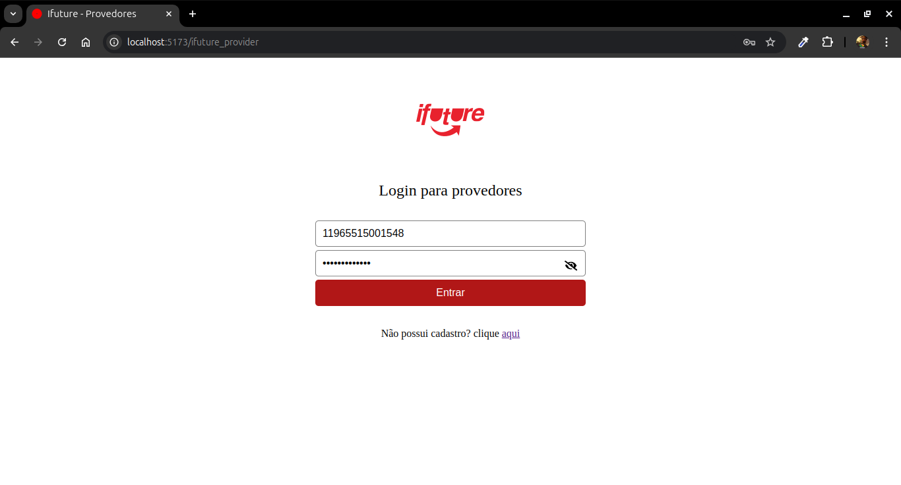
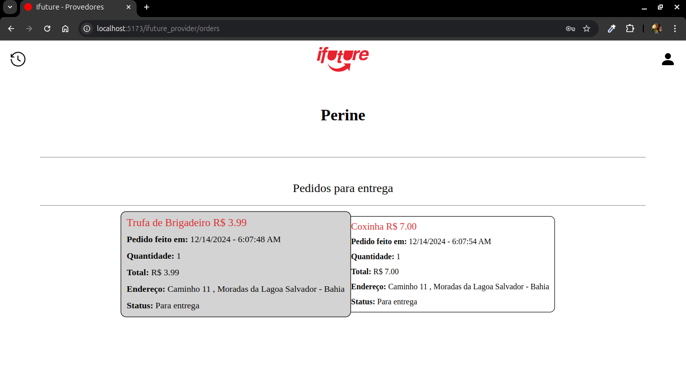
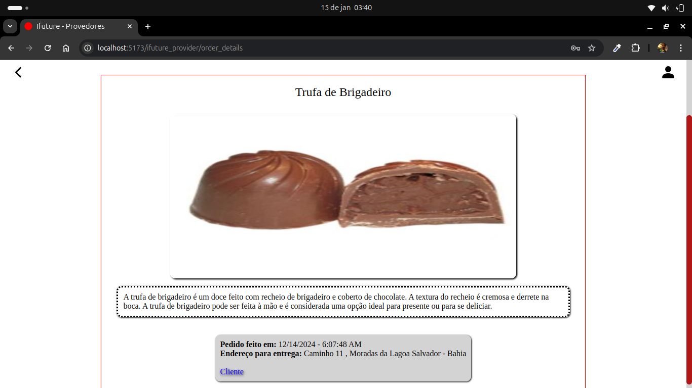

# Ifuture Provider

## Tela de login:

Como se trata de uma demonstração resolvi deixar, como valor padrão dos inputs, as credenciais dos usuários. De maneira que, cada vez que a página é carregada, uma credencial válida é aleatoriamente posta.

## Pedidos para entrega:

Tela inicial com os pedidos para ser entregue. Cada pedido vem especificando o produto com seu valor, quantidade, momento da 
solicitação e endereço para entrega. 
Clicando no card do pedido o usuário é direcionado à página de detalhes do mesmo.

  

    <small>Tela de pedidos</small> 
    
  

  

    <small>Detalhes do pedido</small> 
     
    <small>
      Nos detalhes do pedido, clicando no link "Cliente", se tem acesso ao cadastro do cliente que realizou o pedido.
    </small>
  

