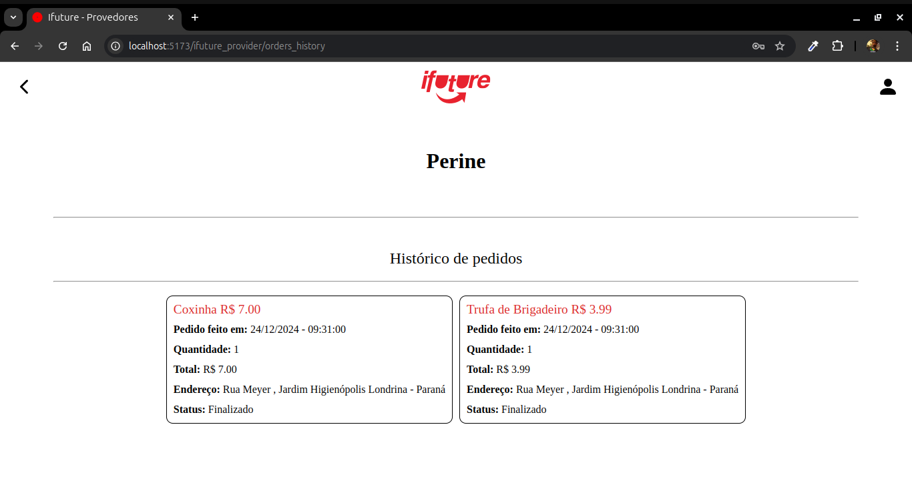
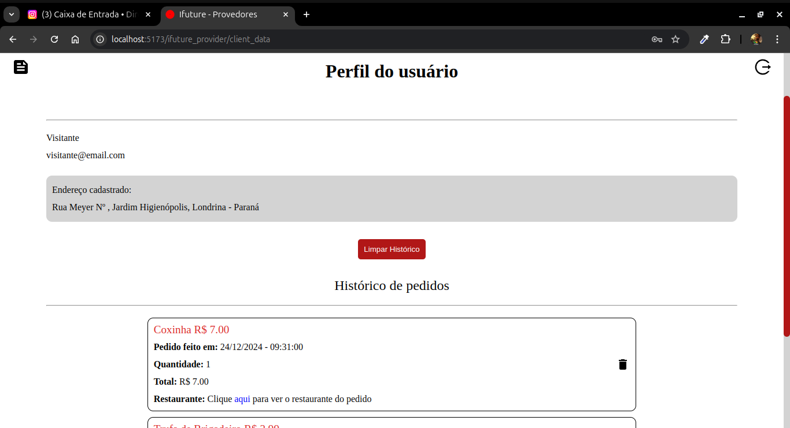
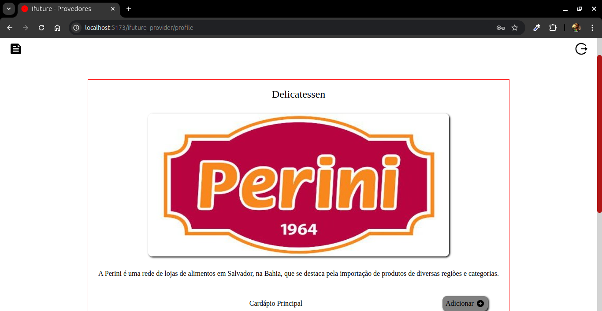
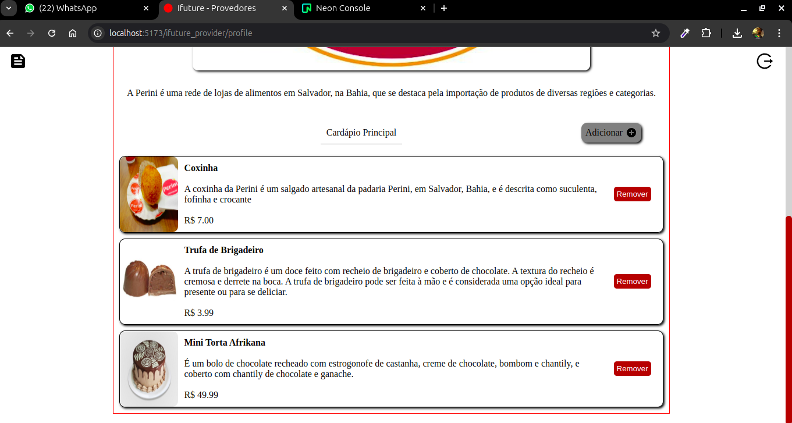
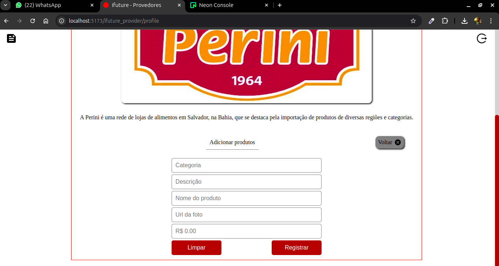

# Ifuture Provider
Aplicação Ifuture para os provedores de serviços de entrega de alimentos. Nessa versão o aplicativo simula a plataforma dos fornecedores do serviço.

## Login

Como se trata de uma demonstração resolvi deixar, como valor padrão dos inputs, as credenciais dos usuários(fornecedores). De maneira que, cada vez que a página é carregada, uma credencial válida é aleatoriamente posta.

## Lista de pedidos

Na tela inicial temos a lista dos pedidos para ser entregue. Cada pedido vem especificando o produto com seu valor, quantidade, momento da solicitação e endereço para entrega. Clicando no ícone do canto superior esquerdo o usuário é direcionado para lista de pedidos finalizados, o hitórico de pedidos.

  

    
  

   
  

     
  

## Detalhes do pedido

Ao clicar no card de algum pedido o usuário tem acesso aos detelhes do mesmo, como mostra a figura abaixo:

Clicando no link "Cliente", o usuário(fornecedor), verá novamente a tela de login, onde serão requisitadas suas credências de acesso para poder ver o cadastro do usuário. Nesse caso, tratando-se de um projeto demonstrativo, as credenciais do fornecedor em questão já são os valores padrões dos campos de login.

## Dados do usuário

Aqui está o perfil do usuário cadastrado. Com seu email, endereço e histórico de pedidos realizados.

## Dados do fornecedor

O perfil do fornecedor. Com sua categoria de serviço no título, uma pequena descrição e lista de produtos do cardápio principal, onde é possível remover e/ou adicionar novos produtos.

 

  

    
  

   
  

     
  

  
> https://gazuadev8417.github.io/ifuture_provider
